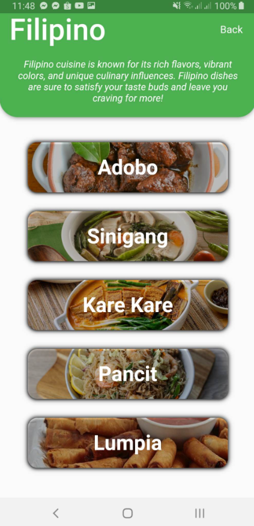

# CookBook 📖

**A Dart-based Recipe App**

## Project Overview

CookBook is a beautifully designed recipe mobile application built using Dart. It allows users to explore, save, and organize a wide variety of recipes, making cooking easy and enjoyable. With features like detailed recipe instructions, ingredient lists, and personalized recipe recommendations, CookBook is the ultimate digital kitchen assistant.

## Features

- **Browse Recipes**: Discover recipes across multiple categories, from breakfast to dessert.
- **Save Favorites**: Bookmark your favorite recipes for easy access anytime.
- **Step-by-Step Instructions**: Clear, easy-to-follow instructions for each recipe.
- **Ingredient List**: Automatically organizes the ingredients you need, making grocery shopping convenient.
- **Personalized Recommendations**: Get recipe suggestions based on your saved favorites and browsing history.

## Screenshots

### Home Screen

### Recipe Detail

## Tech Stack

- **Language**: Dart
- **Framework**: Flutter

## Members

- **Nicolai Isaiah Santos**
- **John Meynard Demandante**
- **Webster Pangan**
